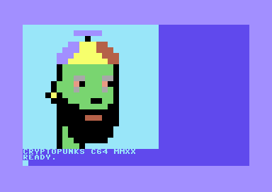

Cryptopunks on the Commodore 64
========


png to C64 BASIC
-------
This is a Go program will read a 24x24 pixel png image and output a BASIC program that will render it.
For example, use this program to convert your favorite "cryptopunk" in to a basic program, that when run, will 
display your punk to be admired in true 8-bit glory!

(More about the "Cryptopunks" [here](https://www.larvalabs.com/cryptopunks))

Screenshots
=====




Technical details
=======

The C64 only allows for 16 colors.

The CIEDE2000 algorithm approximates each pixel to a C64 color, 
thanks to the [co-colorful](https://github.com/lucasb-eyer/go-colorful) library.

Did you know: The C64 used a color palette that may seem "washed-out"? That's because 
these colors displayed well on TVs/CRTs of the day. The analog "saturation" dial was used to fine tune them! 

A simple [Run-length-encoding](https://en.wikipedia.org/wiki/Run-length_encoding) is used for compressing the image. 
The BASIC code that this Go program generates implements a decoder with just a bunch of `GOTO`s.

Getting started
====

To build and generate the c64 BASIC source code:

```
$ go get -u ./...
$ go build
$ ./cryptopunks64

```

How
===
At present there are no arguments, make sure to prepare a 24x24 pmg image in the current directory

The image name should be: `punk.png`

Then run the program.

It will output a BASIC program for the Commodore64 complete with the image data and code to decode it.

You can copy and paste this code to the Vice emulator and type in the "RUN" command.

The program will also output a sample `punk64.png` to show how the image might look when rendered on
an actual C64

BASIC Program listing
=======

Here is an example of a generated BASIC program

```
10 c% = 0 : y% = 0 : i% = 0
20 read c
30 if c = -1 then goto 70
32 read i
33 if i = -1 then goto 70
40 poke 646, c
50 print chr$(18) " ";
51 i = i - 1
52 y = y + 1
53 if y = 24 then print ""
54 if y = 24 then y = 0
55 if i <> 0 then goto 50
60 goto 20
70 print "cryptopunks c64 mmxx";
100 data 3, 81, 14, 5, 3, 21, 0, 1
110 data 3, 20, 14, 2, 7, 3, 2, 2
120 data 3, 16, 14, 3, 7, 3, 2, 3
130 data 3, 14, 14, 3, 7, 5, 2, 3
140 data 3, 13, 14, 2, 7, 7, 2, 2
150 data 3, 13, 0, 1, 5, 9, 0, 1
160 data 3, 13, 0, 1, 5, 9, 0, 1
170 data 3, 13, 0, 1, 5, 2, 12, 2
180 data 5, 3, 12, 2, 0, 1, 3, 12
190 data 0, 1, 5, 3, 10, 1, 0, 1
200 data 5, 3, 10, 1, 0, 2, 3, 12
210 data 0, 1, 5, 3, 12, 1, 5, 4
220 data 12, 1, 5, 1, 0, 1, 3, 11
230 data 0, 1, 7, 1, 0, 1, 5, 9
240 data 0, 1, 3, 12, 0, 3, 5, 4
250 data 0, 2, 5, 2, 0, 1, 3, 13
260 data 0, 4, 5, 5, 0, 2, 3, 13
270 data 0, 11, 3, 13, 0, 5, 2, 3
280 data 0, 3, 3, 13, 0, 11, 3, 13
290 data 0, 1, 5, 1, 0, 8, 3, 14
300 data 0, 1, 5, 1, 0, 8, 3, 14
310 data 0, 1, 5, 2, 0, 6, 3, 15
320 data 0, 1, 5, 3, 0, 1, 3, 13
330 data -1
```

C64 Disk Image demo
====

See `punk64.d64` for the disk image.

Then, `LOAD "*",8`

and then `RUN`


License
===

BSD